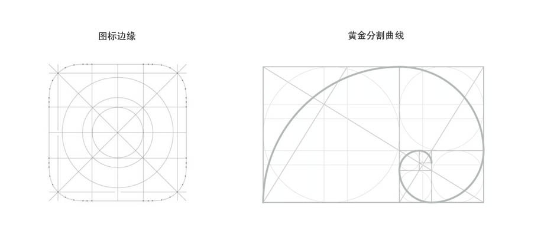

# Avatar 头像
头像可以是图标、图片或者字符的形式，用来展示用户的信息或者事务的信息

## 基本用法
可以通过 `shape` 和 `size` 来设置形状和大小

:::demo
```html
<div>
  <div style="display: flex; flex-direction: row; justify-content: flex-start">
    <div v-for="item,index in list" :key="index" style="margin: 0 20px;">
      <Avatar :src="item" shape="circle" :size="size[index]"></Avatar>
    </div>
  </div>
  <div style="display: flex; flex-direction: row; justify-content: flex-start; margin-top: 20px;">
    <div v-for="item,index in list" :key="index" style="margin: 0 20px;">
      <Avatar :src="item" shape="square" :size="size[index]"></Avatar>
    </div>
  </div>
  <div style="display: flex; flex-direction: row; justify-content: flex-start; margin-top: 20px;">
    <div v-for="item,index in list" :key="index" style="margin: 0 20px;">
      <Avatar :src="item" shape="icon" :size="size[index]"></Avatar>
    </div>
  </div>
</div>

<script>
export default {
  data () {
    return {
      list: [
        '//cdn.illiaccess.com/images/IMG_2809.JPG',
        '//cdn.illiaccess.com/images/IMG_2810.JPG',
        '//cdn.illiaccess.com/images/IMG_0677.JPG',
        '//cdn.illiaccess.com/images/IMG_2805.JPG',
        '//cdn.illiaccess.com/images/IMG_9609.jpg'
      ],
      size: ['l', 'm', 's', 128, 60]
    }
  }
}
</script>
```
:::

当 `shape` 设置为 `icon` 时与 `square` 的区别：

根据苹果的设计，每个应用图标的圆角半径复合黄金分割曲线的设计，即：圆角半径为 `边长 * (1 - 0.618) / 2`


## 展示类型
支持图标、图片和字符

:::demo
```html
<div style="display: flex; flex-direction: row; justify-content: flex-start">
  <div style="margin: 0 20px;">
    <Avatar icon="" shape="circle" :size="60"></Avatar>
  </div>
  <div style="margin: 0 20px;">
    <Avatar name="Deja vu" shape="circle" :size="60"></Avatar>
  </div>
  <div style="margin: 0 20px;">
    <Avatar src="//cdn.illiaccess.com/images/IMG_2805.JPG" shape="circle" :size="60"></Avatar>
  </div>
</div>
```
:::

## Attributes
| 参数 | 说明 | 类型 | 可选值 | 默认值 | 备注 |
| :----- | :----- | :----- | :----- | :----- | :----- |
| src | 头像图片 | String | - | - | 不能和 name, icon 一起使用 |
| name | 头像上显示的文字 | String | - | - | 不能和 src, icon 一起使用 |
| icon | 头像上显示的图标 | String | - | - | 不能和 src, name 一起使用 |
| size | 尺寸 | String/Number | `s`, `m`, `l`, 数字 | m | 当用数字渲染是，单位是 px |
| shape | 头像形状 | String | `circle`, `square`, `icon` | - | - |
| fit | 确定头像图片如何适应容器，属性对应 object-fit | String | `fill` / `contain` / `cover` / `none` / `scale-down` | `none` | - |
