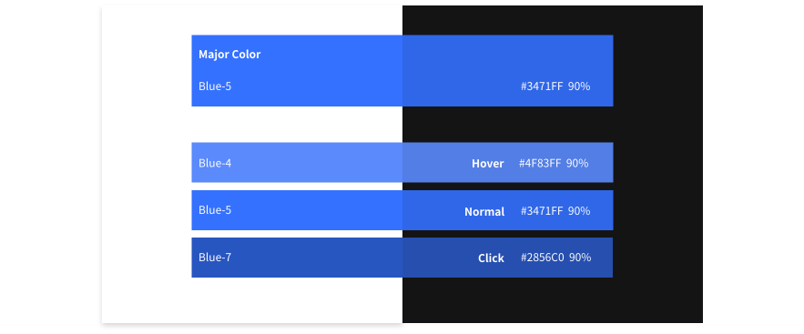
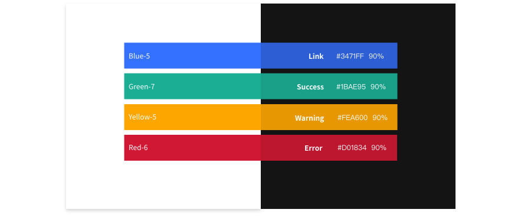
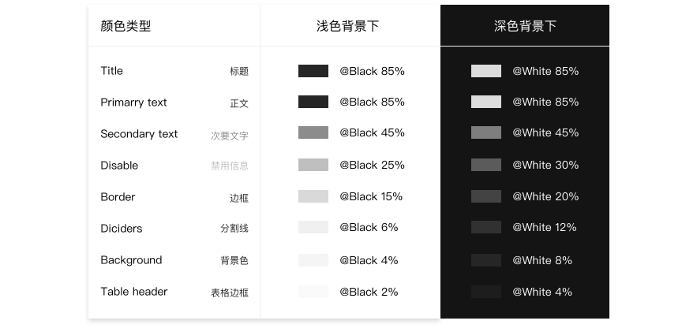

# 色彩
Deja vu 将色彩体系解读成两个层面：系统级色彩体系和产品级色彩体系。

系统级色彩体系主要定义了 Deja vu 中台设计中的基础色板、中性色板和数据可视化色板。产品级色彩体系则是在具体设计过程中，基于系统色彩进一步定义符合产品调性以及功能诉求的颜色。

## 设计师专属
Deja vu 的设计团队倾向于采用 HSB 色彩模型进行设计，该模型更便于设计师在调整色彩时对于颜色有明确的心理预期，同时也方便团队间的沟通。

## 系统级色彩体系
Deja vu 系统级色彩体系同样源于「自然」的设计价值观。设计师通过对自然场景的抽象捕捉，结合技术基因，形成了特有的 12 色。进一步又通过大量的观察，捕捉不同色彩在自然光下的变化规律，借助美术中素描的思路，对 12 个颜色进行了衍生。在中性色板的定义上，则是平衡了可读性、美感以及可用性得出的。

### 基础色板
Deja vu 的基础色板共计 6 个颜色，包含 60 个主色以及衍生色。这些颜色基本可以满足中后台设计中对于颜色的需求。

  

    

      
Sunglow Red/朝霞红

      
斗志、奔放

    

    

      

        
Red-1

        
#FFBCBC

      

      

        
Red-2

        
#F85871

      

      

        
Red-3

        
#F22F4C

      

      

        
Red-4

        
#F01537

      

      

        
Red-5

        
major

        
#E21837

      

      

        
Red-6

        
#D01834

      

      

        
Red-7

        
#C31530

      

      

        
Red-8

        
#A31228

      

      

        
Red-9

        
#810B1E

      

      

        
Red-10

        
#6B0011

      

    

  

  

    

      
Daybreak Blue/拂晓蓝

      
探索、钻研

    

    

      

        
Blue-1

        
#DAE5FF

      

      

        
Blue-2

        
#A4BFFF

      

      

        
Blue-3

        
#779FFF

      

      

        
Blue-4

        
#5A8AFC

      

      

        
Blue-5

        
major

        
#3471FF

      

      

        
Blue-6

        
#285DD7

      

      

        
Blue-7

        
#2856C0

      

      

        
Blue-8

        
#2047A2

      

      

        
Blue-9

        
#0F3283

      

      

        
Blue-10

        
#00206B

      

    

  

  

    

      
Elite Purple/精锐紫

      
包容、科技

    

    

      

        
Purple-1

        
#E3E2FF

      

      

        
Purple-2

        
#ACA9F8

      

      

        
Purple-3

        
#8E89FF

      

      

        
Purple-4

        
#7D78F1

      

      

        
Purple-5

        
major

        
#6C67E8

      

      

        
Purple-6

        
#635ED7

      

      

        
Purple-7

        
#4E49BA

      

      

        
Purple-8

        
#3F3C9B

      

      

        
Purple-9

        
#3C388A

      

      

        
Purple-10

        
#292666

      

    

  

  

    

      
Glowing Yellow/闪耀黄

      
温暖、欢快

    

    

      

        
Yellow-1

        
#FFEBB5

      

      

        
Yellow-2

        
#F8DA89

      

      

        
Yellow-3

        
#FCCF59

      

      

        
Yellow-4

        
#FDC122

      

      

        
Yellow-5

        
major

        
#FEA600

      

      

        
Yellow-6

        
#FE9A00

      

      

        
Yellow-7

        
#F29300

      

      

        
Yellow-8

        
#E08800

      

      

        
Yellow-9

        
#CC7D01

      

      

        
Yellow-10

        
#A36400

      

    

  

  

    

      
Eco Green/生态绿

      
健康、创新

    

    

      

        
Green-1

        
#81FFEF

      

      

        
Green-2

        
#2CFBE0

      

      

        
Green-3

        
#29E9C9

      

      

        
Green-4

        
#26DFBE

      

      

        
Green-5

        
major

        
#28CDB4

      

      

        
Green-6

        
#1FBEA1

      

      

        
Green-7

        
#1BAE95

      

      

        
Green-8

        
#1AA68C

      

      

        
Green-9

        
#148D78

      

      

        
Green-10

        
#0D6F60

      

    

  

  

    

      
Calm Grey/沉稳灰

      
简约、大气

    

    

      

        
Grey-1

        
#B9D1FC

      

      

        
Grey-2

        
#9AB5E3

      

      

        
Grey-3

        
#8198C7

      

      

        
Grey-4

        
#6D82AD

      

      

        
Grey-5

        
major

        
#60739B

      

      

        
Grey-6

        
#57698D

      

      

        
Grey-7

        
#526283

      

      

        
Grey-8

        
#465471

      

      

        
Grey-9

        
#38435B

      

      

        
Grey-10

        
#323A4E

      

    

  

Deja vu 的色板还具备进一步拓展的能力。经过设计师和程序员的精心调制，结合了色彩自然变化的规律，我们得出了一套色彩生成工具，当有进一步色彩设计需求时，设计者只需按照一定规则定义完毕主色，便可以自动获得一系列完整的衍生色。

### 中性色板
中性色包含了黑、白、灰。在中台的网页设计中被大量使用到，合理地选择中性色能够令页面信息具备良好的主次关系，助力阅读体验。HONGQI Design 的中性色板一共包含了从白到黑的 13 个颜色。

    
grey-1

    
#FFFFFF

  

  

    
grey-2

    
#FAFAFA

  

  

    
grey-3

    
#F5F5F5

  

  

    
grey-4

    
#F0F0F0

  

  

    
grey-5

    
#D9D9D9

  

  

    
grey-6

    
#BFBFBF

  

  

    
grey-7

    
#8C8C8C

  

  

    
grey-8

    
#595959

  

  

    
grey-9

    
#262626

  

  

    
grey-10

    
#262626

  

  

    
grey-11

    
#1F1F1F

  

  

    
grey-12

    
#141414

  

## 产品级色彩体系
### 品牌色的应用

品牌色是体现产品特性和传播理念最直观的视觉元素之一。在色彩选取时，需要先明确品牌色在界面中的使用场景及范围。在基础色板中选择主色，我们建议选择色板从浅至深的第六个颜色作为主色。 Deja vu 的品牌色取自基础色板的蓝色，Hex 值为 #3471FF，应用场景包括：关键行动点，操作状态、重要信息高亮，图形化等场景。

### 功能色
功能色代表了明确的信息以及状态，比如成功、出错、失败、提醒、链接等。功能色的选取需要遵守用户对色彩的基本认知。我们建议在一套产品体系下，功能色尽量保持一致，不要有过多的自定义干扰用户的认知体验。Deja vu 的功能色板如下图：

### 中性色
Deja vu 的中性色主要被大量的应用在界面的文字部分，此外背景、边框、分割线、等场景中也非常常见。产品中性色的定义需要考虑深色背景以及浅色背景的差异，Deja vu的中性色在落地的时候是按照透明度的方式实现的，具体色板如下图：

### 企业级产品设计中的色彩应用
在中台的设计中，我们对于色彩的态度是克制的。色彩在使用时更多的是基于信息传递、操作引导和交互反馈等目的。在不破坏操作效率，影响信息的清晰传达的这些原则之上，理性的选择颜色是关键。当然在配图插画以及展示性页面中可以适当打破这一思路。