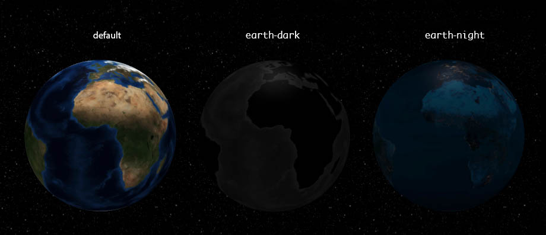
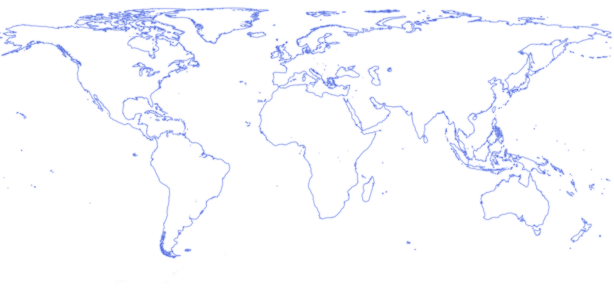
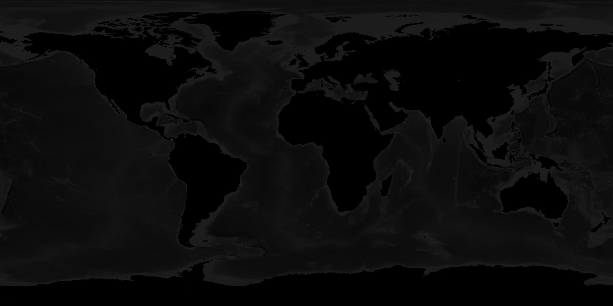
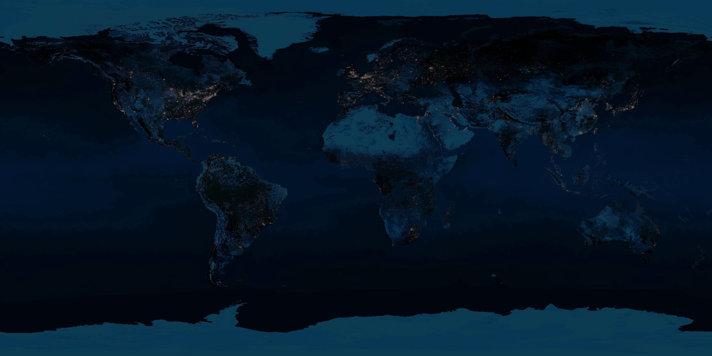

# Globe 地球仪

生成一个带有地球效果的区域，并且可以根据需求展示一些数据

本功能使用 three.js、globe.gl 等库封装，向他们表示感谢

在使用时不必额外安装这些库，Deja vu 的依赖已经替你安装好了

## 基本用法
:::demo
```html
<Globe nightSky></Globe>
```
:::


## Attributes
| 参数 | 说明 | 类型 | 可选值 | 默认值 | 备注 |
| :----- | :----- | :----- | :----- | :----- | :----- |
| width | 容器宽度 | String | - | 100% | - |
| height | 容器高度 | String | - | 400px | - |
| rotate | 自动旋转 | Boolean/Number | - | false | 当设定旋转时，默认转速为 1.8 |
| data | 传入数据 | Array | - | - | 详见使用方法 |
| earth | 地球贴图 | String | default/earth-dark/earth-night | default | - |
| pumb | 显示地形 | Boolean | - | false | - |
| nightSky | 显示夜空 | Boolean | - | false | - |
| atmosphere | 显示大气 | Boolean | - | false | - |
| graticules | 显示经纬网格线 | Boolean | - | false | - |
| haze | 显示漂浮的地形 | Boolean | - | false | haze 是霾的意思 |
| earth | 地球贴图 | String | default/earth-dark/earth-night/url | default | - |
| cover | 地球的覆盖物 | Boolean/Object | - | false | - |

#### earth
earth 属性应传入字符串类型，当传入 url 时，将会根据 url 的贴图对球体进行渲染
当传入 `default`/`earth-dark`/`earth-night` 作为参数时，会渲染成以下效果



## 使用地球仪展示数据
当使用地球仪展示数据时，遵循以下的方法

传入 data 的数据格式时一个包含 `type(String)` 和 `list(Array[Object])` 格式的对象

#### 使用经纬度传入数据
当使用经纬度传入数据时，`type` 配置为 `lnl`（Latitude and longitude），`list` 中的每个对象包含 `lat`, `lng`, `val` 属性
:::demo
```html
<Globe earth="earth-dark" :data="data" :cover="cover" style="background: linear-gradient(#0066cc, #1b0432)"></Globe>

<script>
export default {
  data () {
    return {
      cover: {
        resolution: 2,
        margin: 0.1
      },
      data: {
        type: 'lnl',
        list: [
          {
            lat: 23.904154,
            lng: -11.722282,
            val: 20.08000
          },
          {
            lat: 18.956187,
            lng: -17.789095,
            val: 12.5796
          },
          {
            lat: 11.734199,
            lng: -17.301889,
            val: 69.9893
          }
        ]
      }
    }
  }
}
</script>
```
:::

使用经纬度设置柱条的 `list` 中每个 `{}` 元素的属性设置如下：
| 属性 | 说明 | 类型 | 可选值 | 默认值 | 备注 |
| :----- | :----- | :----- | :----- | :----- | :----- |
| lat | 纬度 | Number | -90 ～ 90 | - | 正值表示东经，负值表示西经，0 是本初子午线 |
| lng | 经度 | Number | -180 ～ 180 | - | 正值表示北纬，负值表示南纬，0 是赤道 |
| val | 用于渲染高度的值 | Number | - | 0 | 在不同的视口下，高度的限制不一样，请自行留意 |

#### 使用国家和地区传入数据
当使用国家和地区传入数据时，`type` 配置为 `country`，`list` 中的每个对象包含 `countryName`, `val` 属性
:::demo
```html
<Globe earth="earth-night" :data="data" :cover="cover" style="background: linear-gradient(#0066cc, #1b0432)"></Globe>

<script>
export default {
  data () {
    return {
      cover: {
        resolution: 3,
        margin: 0.1,
        color: () => `#${Math.round(Math.random() * Math.pow(2, 24)).toString(16).padStart(6, '0')}`
      },
      data: {
        type: 'country',
        list: [
          {
            countryName: 'China',
            val: 20.08000
          },
          {
            countryName: 'Japan',
            val: 7.18032
          }
        ]
      }
    }
  }
}
</script>
```
:::

使用国家和地区设置柱条的 `list` 中每个 `{}` 元素的属性设置如下：
| 属性 | 说明 | 类型 | 可选值 | 默认值 | 备注 |
| :----- | :----- | :----- | :----- | :----- | :----- |
| countryName | 国家/地区名称 | String | - | - | 详情见本页最后的表格 |
| val | 用于渲染高度的值 | Number | - | 0 | 在不同的视口下，高度的限制不一样，请自行留意 |

### cover props
地球六边形覆盖物的属性设置如下：
| 属性 | 说明 | 类型 | 可选值 | 默认值 | 备注 |
| :----- | :----- | :----- | :----- | :----- | :----- |
| resolution | 覆盖物尺寸 | Number | 1 ～ 5 | 2 | 数字越小，面积越大 |
| margin | 覆盖物间距 | Number | 0 ～ 1 | 0.1 | - |
| color | 覆盖物颜色 | function | - | `() => '#1c2044'` | - |

### data props
地球展示数据传入时，遵循以下方法
<!-- 地球六边形覆盖物的属性设置如下：
| 属性 | 说明 | 类型 | 可选值 | 默认值 | 备注 |
| :----- | :----- | :----- | :----- | :----- | :----- |
| resolution | 覆盖物尺寸 | Number | 1 ～ 5 | 2 | 数字越小，面积越大 |
| margin | 覆盖物间距 | Number | 0 ～ 1 | 0.1 | - |
| color | 覆盖物颜色 | function | - | `() => '#1c2044'` | - | -->


### 贴图下载
> 在绘制地球贴图时，请按照以下图片作为每片大陆的绘制基础，否则将无法正确对应覆盖物的位置

- 线框

- earth-dark

- earth-night

### 国家/地区对照表
> 值得注意的是：当涉及到中国时，将被区分为大陆地区和台湾地区，具体使用方法是：

| 国家/地区（英文） | 国家/地区（中文） | 备注 |
| :-----: | :-----: | :----- |
| China | 中国 | 包含大陆地区和台湾地区 |
| Mainland | 中国大陆 | 用于区分大陆地区和台湾地区，也可以传入`China Mainland`或`ChinaMainland` |
| Taiwan | 中国台湾 | 用于区分大陆地区和台湾地区 |

其他国家和地区（按字典顺序排序）请[点击](https://github.com/mitkimi/deja-vu/blob/master/examples/assets/country.md)