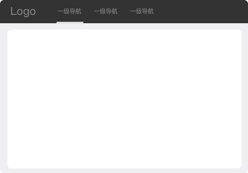

# 导航
导航可以解决用户在访问页面时：在哪里、去哪里、怎样去的问题，一版导航会有`侧栏导航`、`顶部导航`等类型

#### 选择合适的导航
选择合适的导航可以让用户在产品的使用过程中非常的流畅，反之则会引起用户的不适

#### 侧栏导航
将导航栏固定在左侧，提高导航的可见行，方便页面之间的切换
顶部可以放置常用工具，例如搜索、帮助按钮、通知按钮、用户头像等
适用于中台、后台的管理、工具性的网站

###### 一级类目
适用于简单的网站，只有一级页面，不需要使用面包屑

###### 二级类目
当类目较多时，可以抽离成两层的导航模式
使用二级导航是，我们建议搭配使用面包屑，方便用户定位自己的当前位置和快速返回

#### 顶部导航
顺应自上而下的浏览顺序，方便浏览信息。适用于导航较少，页面篇幅较长的网站

